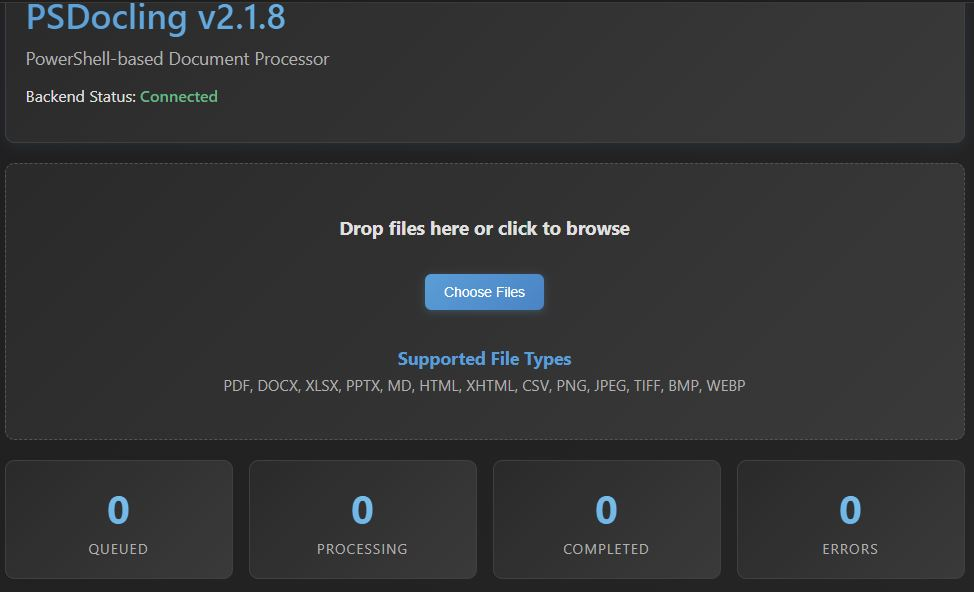
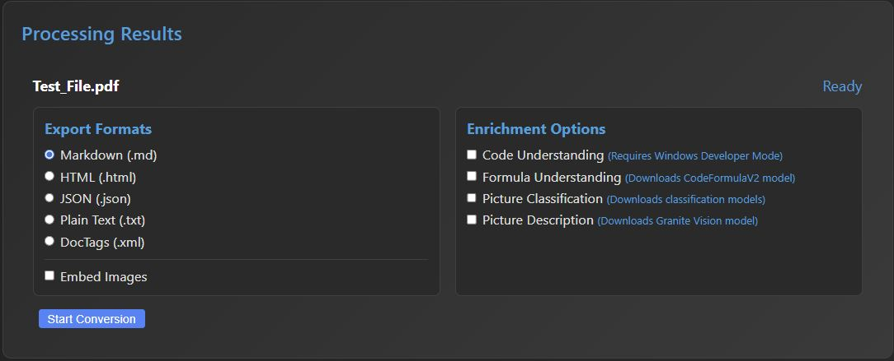

# PSDocling

A PowerShell-based document processing system that converts various document formats (PDF, DOCX, PPTX, XLSX, HTML, MD) to Markdown, JSON, HTML, and Doctags using the Python Docling library. Features a REST API server, document processor, and web frontend.

## Features

- **Multi-Format Support**: PDF, DOCX, XLSX, PPTX, MD, HTML, XHTML, CSV, and images (PNG, JPEG, TIFF, BMP, WEBP)
- **Multiple Output Formats**: Markdown, JSON, HTML, DocTags (with proper XML structure)
- **Queue-Based Processing**: Reliable document processing with status tracking
- **REST API**: HTTP endpoints for programmatic access
- **Web Frontend**: Drag-drop file upload interface with real-time status updates
- **Smart File Management**: Processed Files section shows only generated files with re-process functionality
- **Immediate Updates**: Instant page refresh after document processing completion
- **Advanced Chunking**: Hybrid chunking with semantic and structure-aware document splitting
- **Enrichment Options**: Code understanding, formula detection, picture classification and description
- **Cross-Platform**: Works on Windows PowerShell and PowerShell Core (Linux/macOS)
- **Python Integration**: Leverages the powerful Docling library for document conversion

## Architecture

The system uses a multi-process architecture:

- **API Server**: REST endpoints for document submission and status queries
- **Document Processor**: Background service that converts queued documents
- **Web Frontend**: Single-page application for file upload and management
- **Queue Management**: JSON-based persistence for cross-process communication

## Requirements

- **PowerShell**: 5.1+ or PowerShell Core 6+
- **Python**: 3.8+ (optional for simulation mode)
- **Docling**: `pip install docling` (auto-installed if missing)
- **.NET**: 4.7.2+ (Windows PowerShell)

## Installation

### Quick Install

```powershell
# Clone the repository
git clone https://github.com/joeymiles/PSDocling.git
cd PSDocling

# Install as PowerShell module
.\Install-DoclingModule.ps1

# Or install for all users (requires admin)
.\Install-DoclingModule.ps1 -Scope AllUsers
```

### Manual Installation

1. **Prerequisites**: Python 3.8+ with `docling` package
2. **Clone**: `git clone https://github.com/joeymiles/PSDocling.git`
3. **Import**: `Import-Module .\PSDocling.psm1`

## Usage

### Quick Start

```powershell
# Start all services
.\Start-All.ps1 -GenerateFrontend -OpenBrowser

# Or start programmatically
Import-Module PSDocling
Initialize-DoclingSystem
Start-DoclingSystem
```

### Command Line

```powershell
# Add document to processing queue
Add-DocumentToQueue -Path "C:\Documents\sample.pdf"

# Check system status
Get-DoclingSystemStatus

# Check Python/Docling availability
Get-PythonStatus

# Process with advanced chunking
Invoke-DoclingHybridChunking -FilePath "C:\Documents\report.pdf" -OutputFormat "markdown"

# Test chunking system
Test-EnhancedChunking
```

### Web Interface

Access the web frontend at `http://localhost:8081` to:
- Upload documents via drag-drop
- Monitor processing status in real-time
- Download converted documents
- Re-process documents with different format options
- View detailed error reports

#### Web Interface Screenshots

**Main Interface - File Upload and Processing:**


**Document Upload and Queue Management:**


**Recent Improvements:**
- Processed Files section now shows only generated output files (not original uploads)
- Each generated file includes a "Re-process" button for format conversion
- Immediate page refresh after document processing completes
- Fixed DocTags XML parsing errors with proper XML structure

### REST API

```powershell
# Upload document
Invoke-RestMethod -Uri "http://localhost:8080/upload" -Method Post -InFile "document.pdf"

# Check status
Invoke-RestMethod -Uri "http://localhost:8080/status"

# Get queue
Invoke-RestMethod -Uri "http://localhost:8080/queue"
```

## Configuration

### Default Ports
- **API Server**: 8080
- **Web Frontend**: 8081

### Custom Configuration

```powershell
# Custom ports
.\Start-All.ps1 -ApiPort 9080 -WebPort 9081

# Skip Python check (simulation mode)
.\Start-All.ps1 -SkipPythonCheck

# Generate frontend and open browser
.\Start-All.ps1 -GenerateFrontend -OpenBrowser
```

### File Locations
- **Queue**: `$env:TEMP\docling_queue.json`
- **Status**: `$env:TEMP\docling_status.json`
- **Temp Directory**: `$env:TEMP\DoclingProcessor`
- **Output Directory**: `.\ProcessedDocuments`

## Functions

### Core Functions
- `Initialize-DoclingSystem` - Setup directories and check dependencies
- `Start-DoclingSystem` - Launch all services
- `Add-DocumentToQueue` - Queue documents for processing
- `Get-DoclingSystemStatus` - System status and statistics
- `Get-PythonStatus` - Check Python and Docling availability

### Queue Management
- `Get-QueueItems` - Retrieve all queue items
- `Add-QueueItem` - Add item to queue
- `Get-NextQueueItem` - Get next item for processing
- `Get-ProcessingStatus` - Get processing status
- `Set-ProcessingStatus` - Set processing status
- `Update-ItemStatus` - Update processing status
- `Clear-PSDoclingSystem` - Clear all queued items and processing status

### Services
- `Start-APIServer` - Launch REST API server
- `Start-DocumentProcessor` - Launch background processor
- `New-FrontendFiles` - Generate web frontend

### Advanced Processing
- `Invoke-DoclingHybridChunking` - Process documents with hybrid chunking
- `Test-EnhancedChunking` - Test the chunking system with sample documents

## Advanced Chunking

The PSDocling module includes advanced document chunking capabilities for better document processing and analysis:

### Hybrid Chunking

```powershell
# Basic chunking with default settings
$result = Invoke-DoclingHybridChunking -FilePath "document.pdf"

# Custom chunk sizes
$result = Invoke-DoclingHybridChunking -FilePath "report.docx" `
    -MaxChunkSize 1500 `
    -MinChunkSize 300 `
    -OutputFormat "json"

# Enable all enrichment options
$result = Invoke-DoclingHybridChunking -FilePath "technical.pdf" `
    -EnableCodeEnrichment `
    -EnableFormulaEnrichment `
    -EnablePictureClassification `
    -EnablePictureDescription
```

### Features
- **Semantic Chunking**: Preserves document structure and meaning
- **Structure-Aware**: Respects headers, sections, and paragraphs
- **Table Handling**: Keeps tables intact as single chunks
- **Code Block Preservation**: Maintains code blocks as complete units
- **Smart Overlap**: Configurable overlap for context preservation

## Development

### Testing Without Python

```powershell
# Simulation mode for UI testing
.\Start-All.ps1 -SkipPythonCheck
```

### Module Development

```powershell
# Import for interactive testing
Import-Module .\PSDocling.psm1 -Force

# Test specific functions
Initialize-DoclingSystem -GenerateFrontend
$status = Get-DoclingSystemStatus
```

## Troubleshooting

### Common Issues

**Python not found**:
```powershell
# Install Python and Docling
python -m pip install docling
```

**Port conflicts**:
```powershell
# Use different ports
.\Start-All.ps1 -ApiPort 9080 -WebPort 9081
```

**Permission issues**:
```powershell
# Run as Administrator for URL ACL setup
.\Start-All.ps1 -EnsureUrlAcl
```

**DocTags XML parsing errors**:
- DocTags output is now automatically wrapped in proper XML structure
- Generated XML files are valid and can be viewed in browsers
- If you encounter parsing issues, try re-processing the document

**Processed Files not showing**:
- Only generated files (.md, .xml, .html, .json) appear in Processed Files
- Original uploaded files are not listed (by design)
- Use the "Re-process" button on generated files to convert to different formats

## Contributing

1. Fork the repository
2. Create a feature branch
3. Make your changes
4. Test thoroughly
5. Submit a pull request

## License

Copyright (c) 2025 Joey A Miles. All rights reserved.

## Support

- **Issues**: [GitHub Issues](https://github.com/joeymiles/PSDocling/issues)
- **Examples**: Check `HowTo.ps1` for usage examples