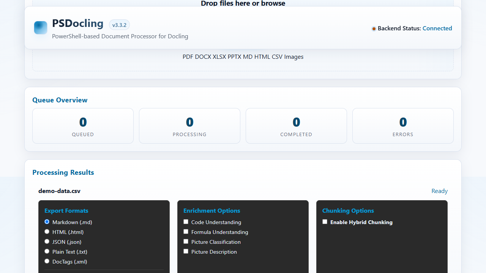

# PSDocling

PowerShell module that wraps Python [Docling](https://docling-project.github.io/docling/) for document conversion. Convert PDFs, Office files, HTML, Markdown, CSV, and images to Markdown, HTML, JSON, plain text, or DocTags. Runs as a local desktop app with its own window, and also exposes a local REST API.

**Version:** 3.3.2 - **License:** MIT

## Demo



## Requirements

- Windows with PowerShell 5.1+ (PowerShell 7 also works)
- Python 3.8+ with the `docling` package (installed on first start if missing; simulation mode without Python)
- Native window: `pip install -r app/requirements-webview.txt` (pywebview). Without it PSDocling opens in an Edge or Chrome app window.

## Install

```powershell
git clone https://github.com/joeymiles/PSDocling.git
cd PSDocling
.\app\scripts\Install-DoclingModule.ps1
```

The installer builds the module, installs it for the current user and offers a desktop shortcut. Reinstall with `-Force`; skip the question with `-DesktopShortcut` or `-NoDesktopShortcut`.

## Start and quit

- **Desktop shortcut** (or double-click `PSDocling.cmd` in a checkout). PSDocling starts without a console window and opens in its own window. On first run it offers to add the shortcut if you do not have one.
- **Quit** in the app header stops the API, the processor and the window. Closing the window does the same.
- If PSDocling cannot start (for example the port is taken), a message box explains why and the reason is saved to `logs\last-launch-error.txt`.

From PowerShell:

```powershell
Import-Module PSDocling
Initialize-DoclingSystem
Start-DoclingSystem -UseWebView      # own window; -OpenBrowser for a browser tab, neither for headless
Stop-DoclingSystem
```

## Where things live

| What | Default |
|------|---------|
| App and API | `http://localhost:8080` (loopback only; change with `-Port`) |
| Data folder | `%LOCALAPPDATA%\PSDocling` (override with `PSDOCLING_HOME`) |
| Queue, history, uploads, converted output | `data\` in the data folder |
| Logs (size capped) | `logs\` in the data folder |
| Per-run token, process ids | `run\` in the data folder |

## Security defaults

- The API listens on `localhost` only and serves the UI from the same origin; there is no cross-origin access.
- Every request that changes something (upload, convert, cancel, quit, uninstall) needs the per-run token. The app sends it automatically; scripts can read it from `run\token.txt` and send it as the `X-PSDocling-Token` header.
- Requests with a non-loopback `Host` header are rejected.

```powershell
$token = Get-Content "$env:LOCALAPPDATA\PSDocling\run\token.txt"
Invoke-RestMethod http://localhost:8080/api/status
Invoke-RestMethod http://localhost:8080/api/cancel/<id> -Method POST -Headers @{ 'X-PSDocling-Token' = $token }
```

## Uninstall

Use **Settings > Uninstall PSDocling** in the app, or run:

```powershell
& "$([Environment]::GetFolderPath('MyDocuments'))\PowerShell\Modules\PSDocling\Uninstall-PSDocling.ps1"
```

Uninstall stops PSDocling and removes the module and its desktop shortcut. After a warning it **deletes the data folder**, including converted documents, so download what you want to keep first. Removing the Python packages PSDocling installed (docling, tokenizers, pywebview) is optional and off by default; Python itself is never removed. A repo checkout is not deleted.

## Features

- Input: PDF, DOCX, XLSX, PPTX, MD, HTML/XHTML, CSV, PNG/JPEG/TIFF/BMP/WEBP
- Output: Markdown, HTML, JSON, plain text, DocTags (XML)
- Queue-based processing with status tracking
- REST API for programmatic upload/status/download
- Drag-and-drop UI with in-app dialogs and notifications
- Optional enrichments (code, formulas, picture classification/description)
- Optional hybrid chunking for RAG workflows

## Architecture

Two hidden PowerShell processes: the API server (which also serves the UI) and a background document processor that runs Docling. Work items move through a folder-based queue with status files in the data folder. The window is pywebview (or an Edge/Chrome app window).

## Documentation

- [Overview](app/Help_files/00_Overview.md)
- [Backend services](app/Help_files/01_Backend_Services.md)
- [Frontend services](app/Help_files/02_Frontend_Services.md)
- [File processing](app/Help_files/03_File_Processing.md)

```powershell
Get-Help Start-DoclingSystem -Full
Get-Help Add-DocumentToQueue -Examples
```

## Repository layout

```
PSDocling/
  PSDocling.cmd        # Start from a checkout (hidden console, own window)
  README.md, LICENSE
  app/
    Source/            # Module source (authoritative)
    DoclingFrontend/   # Web UI and psdocling.ico (served by the API)
    scripts/           # Install, Uninstall, Start-PSDocling launcher, dev Start-All/Stop-All, icon generator
    Tests/             # Audit, E2E, lifecycle, launcher and uninstall tests
    Help_files/        # User guides
    docs/              # README images
    PSDocling.psd1     # Manifest
    Build/             # Built module (generated, not in git)
```

## Development

```powershell
.\app\scripts\Start-All.ps1 -OpenBrowser      # build this checkout and run it with a console
.\app\scripts\Stop-All.ps1
.\app\Tests\Test-AuditFixes.ps1               # static and queue checks
.\app\Tests\Test-Lifecycle.ps1 -WithWindow    # Quit, window close, idle shutdown
.\app\Tests\Test-Launcher.ps1                 # launcher, shortcut, port conflict
.\app\Tests\Test-Uninstall.ps1                # install and uninstall, fully redirected
.\app\Tests\Test-E2EUploadProcess.ps1         # needs a running app on 8080 and Docling
```

`Start-All.ps1` always uses this checkout's build, never an installed copy.

## License

MIT — see [LICENSE](LICENSE).
