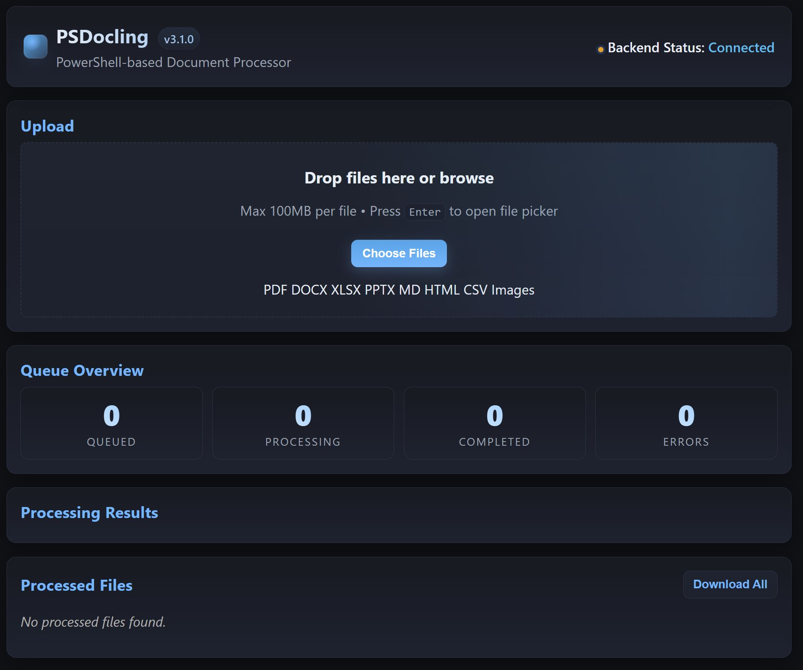

# 📄 PSDocling - A PowerShell Document Processing Module

[](https://github.com/PowerShell/PowerShell)
[](https://docling-project.github.io/docling/)
[](https://www.python.org/)
[](LICENSE)
[](https://github.com/joeymiles/PSDocling)

Say hello to the powerful PowerShell module that provides enterprise-grade document conversion capabilities using Python's Docling library. Convert PDFs, Office documents, HTML, Markdown, and images to various formats with advanced processing options.

## ✨ Features

- 📁 **Multi-Format Support**: PDF, DOCX, XLSX, PPTX, MD, HTML, XHTML, CSV, and images (PNG, JPEG, TIFF, BMP, WEBP)
- 🎯 **Multiple Output Formats**: Markdown, JSON, HTML, DocTags (with proper XML structure)
- 🔄 **Queue-Based Processing**: Reliable document processing with status tracking
- 🔌 **REST API**: HTTP endpoints for programmatic access
- 🌐 **Web Frontend**: Drag-drop file upload interface with real-time status updates
- 📥 **Smart File Management**: Processed Files section shows only generated files with re-process functionality
- ⚡ **Immediate Updates**: Instant page refresh after document processing completion
- 🧩 **Advanced Chunking**: Hybrid chunking with semantic and structure-aware document splitting
- 🔬 **Enrichment Options**: Code understanding, formula detection, picture classification and description
- 💻 **Cross-Platform**: Works on Windows PowerShell and PowerShell Core (Linux/macOS)
- 🔧 **Python Integration**: Leverages the powerful Docling library for document conversion

## 🏗️ Architecture

The system uses a multi-process architecture:

- **API Server**: REST endpoints for document submission and status queries
- **Document Processor**: Background service that converts queued documents
- **Web Frontend**: Single-page application for file upload and management
- **Queue Management**: JSON-based persistence for cross-process communication

## 📋 Requirements

- **PowerShell**: 5.1+ or PowerShell Core 6+
- **Python**: 3.8+ (optional for simulation mode)
- **Docling**: `pip install docling` (auto-installed if missing)
- **.NET**: 4.7.2+ (Windows PowerShell)

## 🚀 Installation

### Quick Install

```powershell
# Clone the repository
git clone https://github.com/joeymiles/PSDocling.git
cd PSDocling

# Install as PowerShell module
.\Install-DoclingModule.ps1

# Or install for all users (requires admin)
.\Install-DoclingModule.ps1 -Scope AllUsers
```

### Manual Installation

1. **Prerequisites**: Python 3.8+ with `docling` package
2. **Clone**: `git clone https://github.com/joeymiles/PSDocling.git`
3. **Import**: `Import-Module .\PSDocling.psm1`

## 💻 Usage

### Quick Start

```powershell
# Start all services with web interface
.\Start-All.ps1 -GenerateFrontend -OpenBrowser
```

The web interface will open automatically at `http://localhost:8081`

### 🌐 Web Interface

#### Main Dashboard

*Clean, intuitive interface for document processing with drag-drop support*

#### File Upload & Processing

*Real-time processing status with progress tracking*

#### Re-process Documents

*Convert processed documents to different formats without re-uploading*

**Features:**
- 📁 Drag-drop file upload
- 📊 Real-time processing status
- 🔄 Re-process to different formats
- 📥 Direct download of converted files
- 🎯 Format-specific enrichment options

### 🔌 REST API

For programmatic access, see the [Backend Services Guide](Help_files/01_Backend_Services.md).

## ⚙️ Configuration

### Default Ports
- **API Server**: 8080
- **Web Frontend**: 8081

### Custom Configuration

```powershell
# Custom ports
.\Start-All.ps1 -ApiPort 9080 -WebPort 9081

# Skip Python check (simulation mode)
.\Start-All.ps1 -SkipPythonCheck

# Generate frontend and open browser
.\Start-All.ps1 -GenerateFrontend -OpenBrowser
```

### File Locations
- **Queue**: `$env:TEMP\docling_queue.json`
- **Status**: `$env:TEMP\docling_status.json`
- **Temp Directory**: `$env:TEMP\DoclingProcessor`
- **Output Directory**: `.\ProcessedDocuments`

## 📚 Documentation

### Getting Started
- 📖 [Overview & Quick Start](Help_files/00_Overview.md)
- 🖥️ [Frontend Services Guide](Help_files/02_Frontend_Services.md)
- 🔧 [Backend Services Guide](Help_files/01_Backend_Services.md)
- 📄 [File Processing Guide](Help_files/03_File_Processing.md)

### Key Functions
For detailed function documentation and examples, see the guides above or use:
```powershell
Get-Help Add-DocumentToQueue -Full
Get-Help Start-DoclingSystem -Examples
```

## 🎯 Advanced Features

### Document Chunking
Advanced semantic chunking for large documents with structure preservation.
See the [File Processing Guide](Help_files/03_File_Processing.md#advanced-processing) for details.

### Enrichment Options
- 💻 **Code Understanding** - Analyze and understand code blocks
- 🔬 **Formula Detection** - Extract mathematical formulas
- 🖼️ **Picture Analysis** - Classify and describe images
- 📊 **Table Preservation** - Maintain table structures

For configuration details, see [Processing Options](Help_files/03_File_Processing.md#processing-options).

## 🛠️ Development

### Testing Without Python

```powershell
# Simulation mode for UI testing
.\Start-All.ps1 -SkipPythonCheck
```

### Module Development

```powershell
# Import for interactive testing
Import-Module .\PSDocling.psm1 -Force

# Test specific functions
Initialize-DoclingSystem -GenerateFrontend
$status = Get-DoclingSystemStatus
```

## 🔍 Troubleshooting

### Common Issues & Solutions

For detailed troubleshooting, see the [File Processing Guide](Help_files/03_File_Processing.md#troubleshooting).

**Quick Fixes:**
```powershell
# Python not found
python -m pip install docling

# Port conflicts
.\Start-All.ps1 -ApiPort 9080 -WebPort 9081

# Permission issues (run as admin)
.\Start-All.ps1 -EnsureUrlAcl

# Reset stuck processing
.\Stop-All.ps1
.\Start-All.ps1
```

## 🤝 Contributing

1. Fork the repository
2. Create a feature branch
3. Make your changes
4. Test thoroughly
5. Submit a pull request

## 📝 License

Copyright (c) 2025 Joey A Miles. All rights reserved.

## 💬 Support

- **Issues**: [GitHub Issues](https://github.com/joeymiles/PSDocling/issues)
- **Examples**: Check `HowTo.ps1` for usage examples